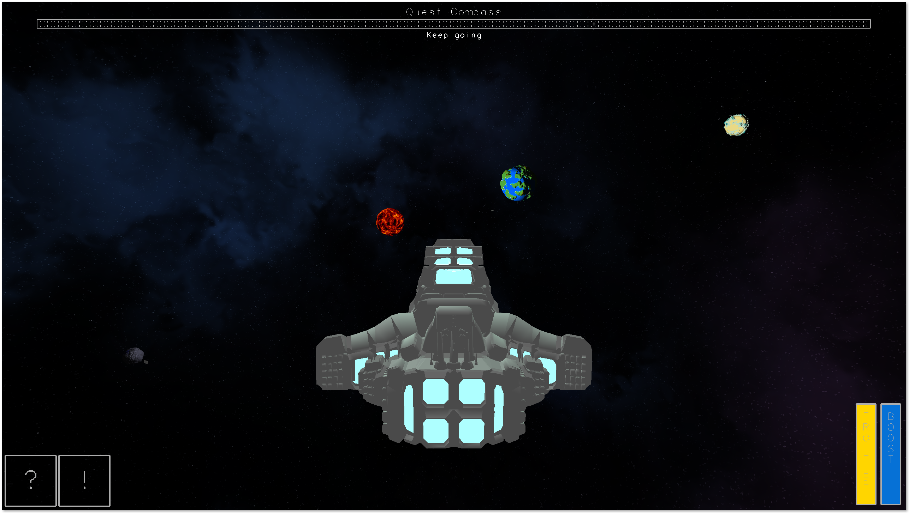
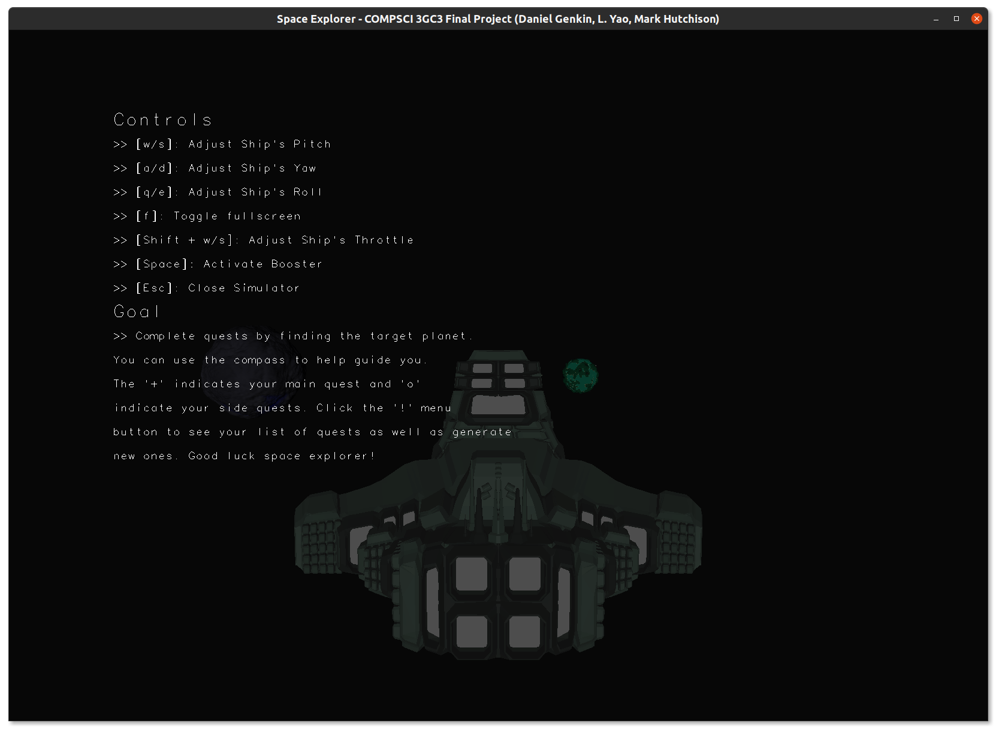
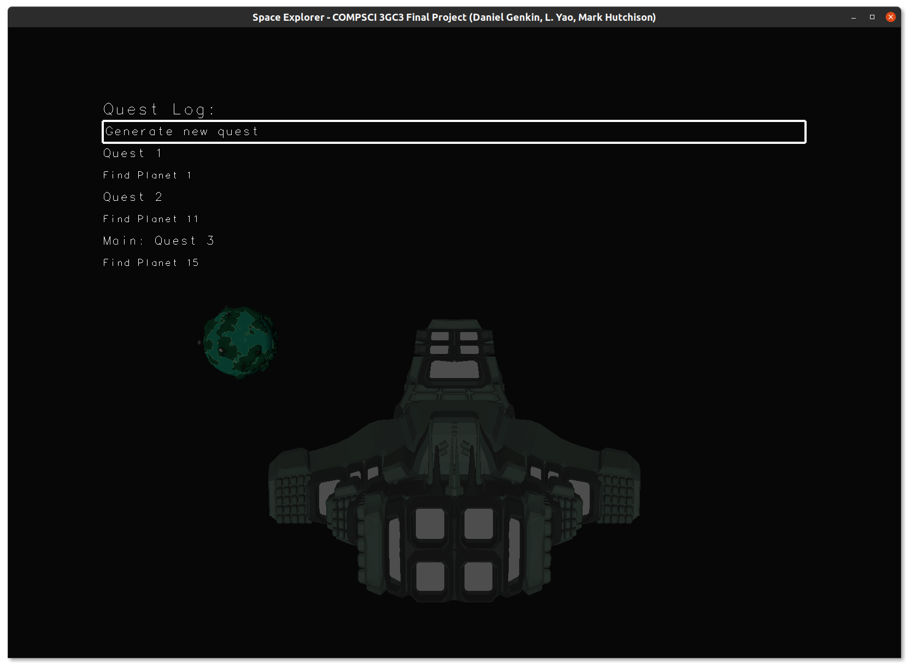

# COMPSCI3GC3_Project - Daniel Genkin, L. Yao, Mark Hutchison

A spaceship simulator with procedurally generated planets, asteroids and quests.

This project was built as part of my COMPSCI 3GC3 course at McMaster University. The task was to build a C++ project that uses the OpenGL Fixed Pipeline to render a 3D environment, game or simulation. My group, consisting of three poeple, achieved a final mark of 130% as we successfully implemented all the required features as well as several additional bonus features. Code quality was marked generously as the main focus of the course was graphics. Thus, there are several improvement we could make to the code quality for maintainability and extendability in the future.





*We primarily target Linux as we are all on Linux machines (or at least in Linux environments). So although MacOS works, it is less than ideal. We don't support Windows.*

## Objective

Complete quests by finding the target planet. You can use the compass to help guide you. The '+' indicates your main quest and 'o' indicates your side quests. Click the '!' menu button to see your list of quests as well as generate new ones. Good luck space explorer!

## Controls

| Action | Functionality          |
| ------ | -----------------------|
| w/s    | Adjust Ship's Pitch    |
| a/d    | Adjust Ship's Yaw      |
| q/e    | Adjust Ship's Roll     |
| f      | Toggle fullscreen      |
| W/S    | Adjust Ship's Throttle |
| Space  | Activate Booster       |
| ESC    | Close Simulator        |

**If you are ever lost, click the '?' button in the bottom left of the window to show help information**

## 'Additional Features' as per the assignment pdf
- Lighting (see the Lighting section)
- Textures (the object loader supports loading diffuse textures but also we generate them procedurally for celestial objects)
- UI (see the overview of graphics 2D section)
- Advanced camera control (to avoid gimbal lock we use a quaternion based camera control system)
- Shaders (our skybox is rendered via GLSL shaders. We wanted to convert more of the rendering as shaders but did not have time)
- Terrain generation (the scene is fully randomly/procedurally generated)
- Collision system to avoid the ship from going through the planets, outposts and sun objects.
- Asynchronous background loading (loading takes a few seconds, so we show a loading screen on the main thread and load in a background thread)

## Overview of graphics

The program is split into two parts, the 3D and the 2D. The 2D part, controlled by UI/HUD.cpp handles all the modals, buttons, compass, loading screen and other 2D features. The 3D part, controlled by main.cpp, is responsible for all the planets, outposts, the ship and all the other 3D related features of the simulator as well as the HUD. This allows us to abstract all the 2D aspects into the UI folder and avoid mixing 3D and 2D code.

### 3D
As was already mentioned, the 3D features of the simulation are controlled by `main.cpp`. However, to simplify the interaction between classes, we defined two interfaces to provide each 3D element with the same base functionality. The first `Includes/Interfaces/GameObject.h` includes all functionality that all 3D items in the simulation have. Primarily this is the object's transforms for easy and consistent manipulation. The `Includes/Interfaces/Renderable.h` interface provides common methods that all renderable 3D objects have. This involves `render`, `animate`, and other similar functions. This separation allows for great flexibility however is too minimal to create really elaborate objects. So we also defined a set of classes that are used in conjunction to actually store vertices, colors, etc. We will cover some of those below.
 
**Model/Mesh/Material**

All 3D objects, procedurally generated or loaded from a file (see later), are loaded into an instance of `Model` or a child class of it (such as `PlanetModel` in the case of planets). This provides very consistent interaction with 3D models by providing a constant interface for them. The `Model` class is consists of a minimal implementation of the `Renderable` and `gameObject` interfaces as well as a container that holds a vector of `Mesh` which contains a `Material` and the vectors for vertices, normals, texture coordinates, indices and other 3D model rendering data. `Material` is a very general purpose class and we unfortunately did not have enough time to fully implement every possible texture, color and property that OpenGL provides. We were able to implement Diffuse textures, ambient colours, diffuse colours, specular colours, emit colors and shininess.
 
To do the actual rendering of 3D objects we use `glDrawElements`. This is a very convenient, and performant, way of doing it as we store all the vertices, normals, etc as vectors. So we simply pass it to OpenGL and let it do the rest. To implement this, you will see that we re-organize the data in the Object Loading (covered later) to get the data formatted in a consistent way such that vertex n corresponds to normal n and so on.

### 2D
To complement the 3D aspects we designed a fully modular UI framework that is composed of a few primitives (located in UI/Primitives) that can be used in conjunction to make more advanced UI components. There are too many features to go over in their entirety however, we will outline the basic high level ideas here.
 
Essentially everything that is rendered as part of the UI is a self-contained UI entity that extends from `UIItem.h`. Then, we can easily store them in a vector of `UIItem`s and call their render, animate and other functions as needed. `UIItem.h` was designed to be very flexible and this self-contained nature allows us even to support MacOS, which doesn't support all the FreeGlut features that Ubuntu does. All the Primitives are very configurable but provide defaults to ease usage when all the functionality is not required.
 
**Text**

The `Text` element renders `glutStroke` multi-line text. It can center align vertically and horizontally as well as scale and colour it. All text rendered by the project is done through this element to allow for consistency and separation of concerns and minimization of duplication.
 
**Buttons**

The `Button` elements are composed of a `Text` element surrounded by a clickable area. They provide a `hitTest` function that returns true if a point is inside the button's clickable area and an `id` variable. When used in conjunction with the `Modal.mouseClick` function, this can be used to identify if a button was clicked and if so, which one. Unfortunately, we were not able to just store functions in the button that it would call automatically as we are using a class based design and c++ does not provide an easy way to call class member functions without storing an instance of the class. So this solution was more versatile.
 
**Modal**

The `Model` elements are dynamically scaling and positioning containers that can be shown or hidden programmatically. They follow a vertical linear layout approach with every newly added element being positioned below the previous one. Modals, Support rendering anything that extends `UIItem`.
 
## The scene
Once the simulator loads, the user is placed in a proceduarally generated solar system. All the planets, asteroids and their transforms are randomly generated (see the Celestial object generator section). To add an infinite world feeling we use a cubemap skybox that is implemented via shaders (assets/Shaders/skybox).

## Loading sequence and performance
Our project is quite large. As such, it takes about one minute to load the models, generate the planets, generate the quests and build the UI. For this reason, to prevent blocking the main thread with heavy IO operations and thus force the user to stare at a black screen, we asynchronously load everything in a background thread. While that is happening we show a progress bar and log to the user. We outline the loading process below:
 
1. Initialize glut and the OpenGL context
2. Start the loading process (`setupScene` in `main.cpp`) in a background thread
3. Set the loading game loop which shows the loading screen updating the process bar after each step in the loading
4. Once loading completes switch out the `glutDisplayFunc` and `glutTimerFunc` for the actual game ones
 
**Note:** As the planet generation also generates textures, we are unable to load them into OpenGL from the background thread (as the context is not available). To solve this, texture loading is a 2 step process. First we generate/load them (via `Material::setTextureData`) and then after step 3 and before step 4, once loading is completed and we are back on the main thread, we load them into OpenGL (via `Material::loadTexturesIntoOpenGL`).
 
**Note 2:** To speed up duplicate model loading, we use a cache (located in the object loader) to load duplicate models from memory and avoid wasting time reading and parsing the file. This yields huge performance improvements. Especially when normals are not pre-calculated.
 
## Folder structure
- assets - houses various images and 3D models used by the project
- src - the code
  - Interfaces - various virtual classes to be implemented by other classes throughout the project
  - Libs - 3rd party dependencies
  - Includes - headers for the rest of the code
  - Math - Helper math classes and functions
  - Objects - Anything 3D object/model related
    - CelestialObjects - Anything planet and/or asteroid related
    - ObjectLoader - loads obj and mtl files into models
    - Ship - the ship and camera
  - Quests - anything quest related
  - UI - anything UI related
  - Util - other utilities
 
## Celestial Object Generator

Procedurally generated random bumpy spherical objects with corresponding UV textures from a set of predefined configurations stored in assets/Custom/* as JSON files. Planets are generated by normalizing the vertices on a subdivided (based on a set resolution) unit cube and then applying a noise function, followed by mapping a texture based on the elevation of each vertex.

Planets are procedurally generated during loading by the `PlanetModelFactory` which, via the factory coding pattern, generates the vertices and other 3D model data to build `PlanetModels`.
 
### Features
 
- Objects have variable noise filters that generate different styles of terrain
- Objects can have different resolutions for different amounts of detail
- Corresponding diffuse textures are generated to add color to the generated object
  - Textures are generated based on configurable colour gradients. The colour for a particular point depends on its elevation relative
  to the object's highest and lowest point.
- Configuration files are read from JSON files and so can be configured without recompiling the program!
 
## Quests
 
As the user explores the auto generated solar system, they will complete quests. Each quest is randomly generated and involves finding a specific planet. Users can generate up to 6 simultaneous quests. Completing a quest will generate a new one. To generate a new quest manually the user can go to the '!' menu in the bottom left corner of the window and click the 'generate new quest' button.
 
To help guide the user to the target planet(s), there is a compass at the top of the screen. On this compass, the main quest is marked with a '+' and secondary quests with 'o'. As the ship rotates, the location of these indicators updates to correspond to the heading they must maintain to reach the planet.
 
To complete a quest the user must get close enough to the target planet. Note, however, that getting too close will auto engage the crash avoidance system and the ship will automatically dodge the planet.

## Lighting

Our main light source is the sun which all planets orbit. This light radiates from the sun and illuminates the planets on their closest side to the sun. Thus, there are dark areas that are not illuminated, similar to how lighting works in space! However, this causes a rather ugly flat colouring effect on the ship when it is headed towards the sun as no light is hitting the back (i.e. what he user sees). Therefore, we have another light that only affects the ship. This is a weak light to just allow the ship to maintain 3D shading.


## ObjectLoader
 
Loads obj and mtl files into the `Model` data structure.
 
**To speed up loading of repeated models (such as for outposts for example), we store a cache and load form it if we can. This yields huge performance improvements**
 
### How to use
 
```cpp
Loader loader;
 
Model model = loader.loadModelFromAssets("folder name relative to current working directory or absolute", "filename.obj");
```
 
### Supported Features (from MTL file)
 
- Diffuse textures
- Diffuse, Specular, Emit, ambient vertex colors
- Specular Highlights strength (i.e. Shininess)
 
Everything else is read into the Material objects but is not used for rendering (yet).
 
### Supported Features (from Obj file)
 
- UV coordinates importing
- Normal importing (or they are calculated if they aren't included in the model)
- Mesh grouping and object grouping (for materials)
 
### File format
 
When exporting a model through blender, make sure the following settings are set.
 
- Triangulate faces
  - Since we render triangles
- Material groups
  - Since we use it to identify when to change materials (we need the g lines)
- Object groups
  - Since we use it to identify why to switch meshes (we need the o lines)
- Write normals
  - Improves performance as it is precalculated, so we don't have to. Although, we do calculate them if they are missing!
- Include UVs
  - Support for texture mapping. Otherwise the colors are used.
- Model must be set up so that culling culls the back face.
 
**Note:** Make sure that the textures are copied over to the destination folder.
 
### Model structure
 
- Model (object) - extends Renderable and GameObject
 
 - Properties
   - `vector<Mesh *> meshes`
     - List of meshes that make up the model
 - Methods
   - `void render()`
     - renders the model
 
- Mesh (component of object such as a wheel on a car)
 
  - Properties
    - `vector<float> vertices`
      - List of vertices that make up this mesh
      - Each vertex is represented as 3 consecutive floats
    - `vector<float> normals`
      - List of normals for this mesh
      - Each normal is represented as 3 consecutive floats
    - `vector<float> textureCoords`
      - list of texture coordinates for the textures that correspond to  the mesh
      - Each coordinate is represented as 2 consecutive floats
    - `Material* material`
      - The material associated with this mesh
    - `vector<unsigned int> vertexIndices`
      - The indices of the vertices that make up the faces in this mesh  of this part of the mesh
      - It is just a vector of 0..N-1 where N is the number of vertices  (needed for `glDrawElements`)
      - There are the same number of normals, vertices, and textures
  - Methods
    - None
 
- Material
 
  - Properties
    - `string name`
    - `Colour ambient`
    - `Colour diffuse`
    - `Colour specular`
    - `float specularHighlights`
    - `float opticalDensity`
    - `float transparency`
    - `float illumMode`
    - `GLuint diffuseTextureId`
    - `GLuint normalTextureId`
    - `GLuint specularTextureId`
  - Methods
 
   - None
 
 - Colour, Vector3, Point2 are self explanatory
 
## Third party libraries (Libs folder)
 
- FastNoiseLite.h
  - Used for easy random noise generation when building the planets and asteroids
  - [https://github.com/Auburn/FastNoiseLite](https://github.com/Auburn/FastNoiseLite)
- stb_image.cpp/h
  - Used for loading textures in the object loader
  - [https://github.com/nothings/stb](https://github.com/nothings/stb)
- JSON for Modern C++
  - Used to load pre-existing NoiseFilters and Gradients for easy configuration
  - [https://github.com/nlohmann/json](https://github.com/nlohmann/json)
- glad + freeglut
